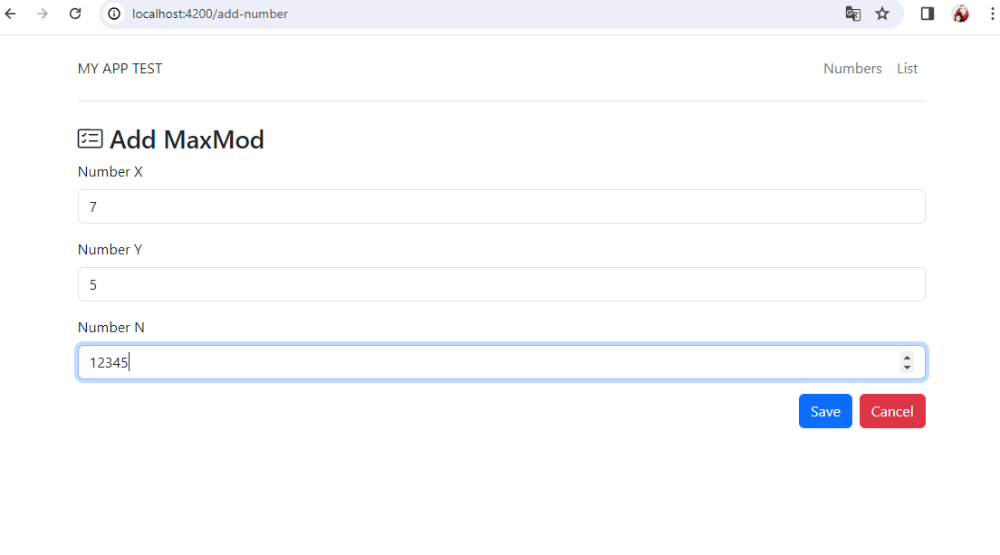
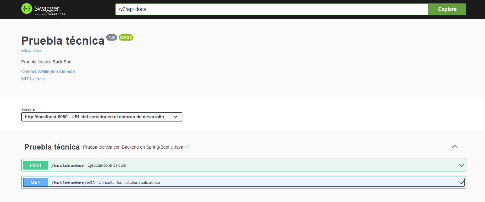

# max-mod-back
prueba técnica

# Requisitos previos

* Package Manager = npm 10.2.3

* java = 11.0.21

* Angular CLI = 17.0.5

* Node = 20.10.0

## Instalación de la aplicación

Descarga NodeJs si no lo tienes instalado en tu máquina

```sh

https://nodejs.org/en/download/

```
# Front-end
Git clone: https://github.com/WellAlmeida31/max-mod-front.git

instalar Node-modules

ng serve

```sh

localhost:4200

```



# Back-end

Git clone: https://github.com/WellAlmeida31/max-mod-back.git

mvn spring-boot::run

```sh

localhost:8080

```

swagger-ui: http://localhost:8080/swagger-ui/index.html

